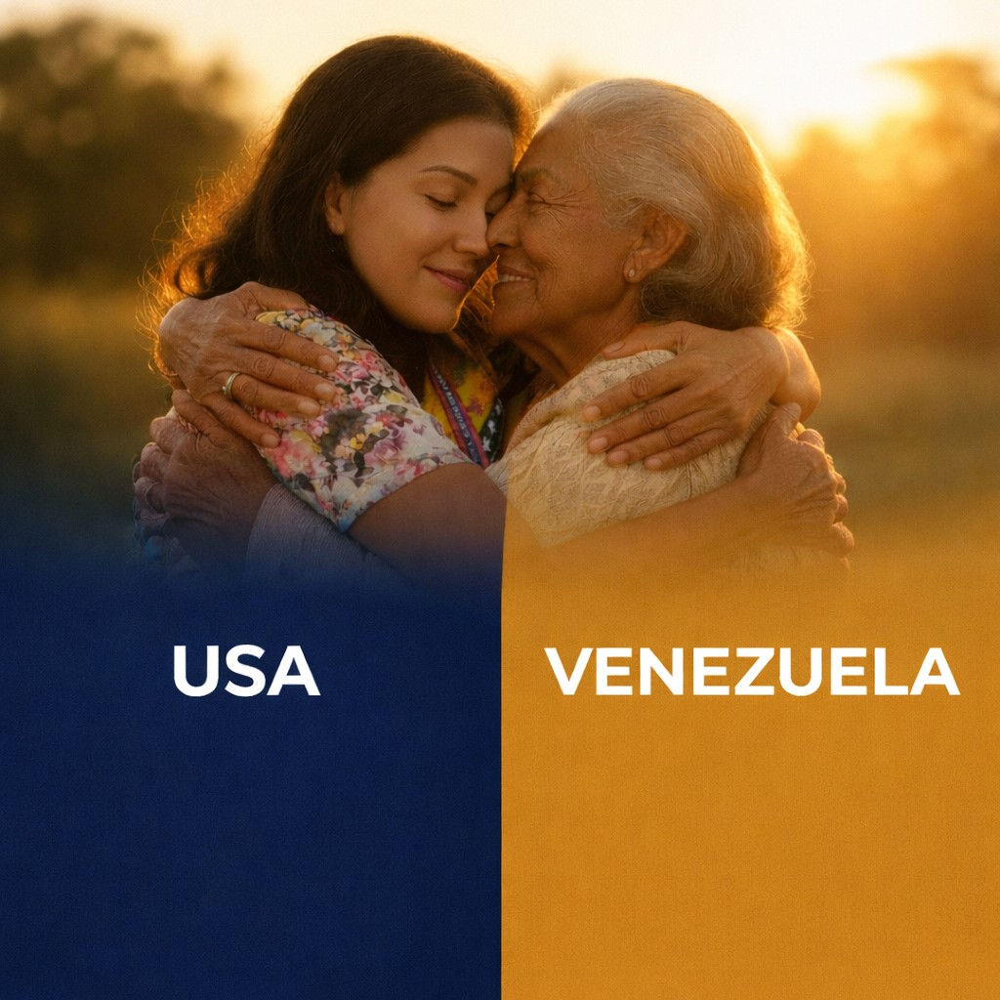

# LEGADO v4 — Documentación Técnica Completa

Sitio web estático para Apache. Sin Node.js, sin React, sin compiladores.
Versión combinada: base V3 + hero fotográfico + sección "Protege" de la versión raíz.

---

## Estructura de archivos

```
legado-v4/
├── index.html              ← Toda la estructura HTML del sitio
├── .htaccess               ← Configuración Apache (caché, GZIP, seguridad)
├── DOCUMENTACION.md        ← Este archivo
│
├── css/
│   └── main.css            ← Todos los estilos (un único archivo)
│
├── js/
│   └── main.js             ← Todo el JavaScript (un único archivo)
│
└── images/
    ├── hero-family.jpg         ← Foto abuelos venezolanos (fondo del hero)
    ├── hands-connection.jpg    ← Foto manos unidas (sección "Protege")
    ├── family-together.jpg     ← Foto familia (storytelling + CTA final)
    └── LogoLegado.png          ← Logo PNG (favicon)
```

---

## Instalación en Apache

### 1. Subir archivos

Copia **toda la carpeta** al DocumentRoot de Apache:

```bash
# Ubuntu/Debian típico
/var/www/html/

# O tu dominio específico
/var/www/tu-dominio.com/public_html/
```

### 2. Activar módulos Apache requeridos

```bash
sudo a2enmod rewrite deflate expires headers
sudo systemctl restart apache2
```

### 3. Permitir .htaccess

En tu VirtualHost (`/etc/apache2/sites-available/tu-sitio.conf`):

```apache
<Directory /var/www/html>
    AllowOverride All
    Options -Indexes
    Require all granted
</Directory>
```

### 4. Activar HTTPS (producción)

Descomenta estas líneas en `.htaccess`:

```apache
RewriteCond %{HTTPS} off
RewriteRule ^ https://%{HTTP_HOST}%{REQUEST_URI} [L,R=301]
```

---

## Configuración del Chatbot (n8n)

Edita `js/main.js`, **primera línea**:

```javascript
const CHAT_WEBHOOK_URL = "https://TU-N8N-WEBHOOK-URL/webhook/chat"; // ← CAMBIAR
```

El webhook debe devolver JSON con alguno de estos campos:
```json
{ "response": "Texto de respuesta del bot" }
{ "message":  "Texto de respuesta del bot" }
{ "content":  "Texto de respuesta del bot" }
```

---

## Contrato del webhook de compra (WIZARD)

El frontend envía al webhook de compra un POST JSON con el siguiente payload:

Request (POST):

```json
{
  "paymentMethod": "card|zelle|bank",
  "plan": "esencial-zulia|vanguardia-zulia|...",
  "paymentType": "monthly|annual",
  "buyer": { "name": "", "lastName": "", "cedula": "", "phone": "", "email": "", "birthDate": "YYYY-MM-DD" },
  "family": [ { "name":"","lastName":"","cedula":"","phone":"","birthDate":"YYYY-MM-DD","relationship":"" }, ... ],
  "timestamp": "ISO8601"
}
```

Respuestas esperadas del webhook (ejemplos):

- Caso Stripe Checkout (recomendado):

Response 200 JSON:

```json
{ "success": true, "checkoutUrl": "https://checkout.stripe.com/pay/.." }
```

El frontend abrirá `checkoutUrl` en una nueva pestaña y cerrará el modal.

- Caso pago offline (Zelle / Transferencia bancaria):

Response 200 JSON:

```json
{ "success": true, "instructions": "Enviar a nombre X, cuenta Y, referencia Z" }
```

El frontend mostrará las instrucciones al usuario (en el modal o como toast).

- Caso éxito simple sin pago inmediato:

Response 200 JSON:

```json
{ "success": true }
```

El frontend mostrará confirmación y cerrará el modal.

- Caso error:

Response 4xx/5xx (opcional body):

```json
{ "success": false, "error": "Mensaje legible" }
```

El frontend mostrará un toast con el error y mantendrá el modal abierto para reintento.

Notas importantes:

- El webhook debe responder con cabecera Content-Type: application/json.
- Si el frontend y el webhook están en dominios distintos, asegúrate que el servidor devuelva
  Access-Control-Allow-Origin: *  (o el dominio del sitio) y permita métodos POST y headers
  Content-Type para que fetch desde el navegador no sea bloqueado por CORS.
 
Nota sobre Stripe: el workflow existente en n8n usa PaymentIntents y devuelve client_secret
cuando el intent es de tipo 'confirm'. El frontend ahora soporta ambos patrones:
- PaymentIntent flow: backend devuelve { client_secret: "...", message: "..." } y el
  frontend monta Stripe Elements, confirma el pago y envía de vuelta intent: 'payment_success'.
- Checkout Session flow: backend devuelve { checkoutUrl: "https://..." } y el frontend
  abre la URL en nueva pestaña.
- Documenta en n8n el flujo de validación de datos (campos obligatorios) y manejo de excepciones.

---

## Ejemplo de flujo n8n para crear sesión Stripe Checkout y devolver checkoutUrl

Este es un flujo de referencia que puedes implementar en n8n. El objetivo: recibir el payload
del frontend, crear una sesión de Stripe Checkout (si paymentMethod === 'card') y devolver
al frontend el checkoutUrl.

1) Webhook Node (HTTP Request)
   - Método: POST
   - Path: /webhook/legado-wizard
   - Response Mode: "On Received" o "Custom Response" (recomendado: devolver JSON con checkoutUrl)

2) Set / Function Node (validación)
   - Valida campos obligatorios: buyer.name, buyer.email, plan, paymentMethod
   - Normaliza montos según plan y paymentType (monthly/annual)

3) If Node (branch by paymentMethod)
   - Condición: paymentMethod == 'card' → crear session de Stripe
   - Else: marcar como "manual payment" y enviar instrucciones

4) Stripe Node (Create Checkout Session)
   - Use your Stripe credentials (secret key) in n8n credentials
   - Mode: payment
   - Line items: describe the product/amount (you can store amount in cents)
   - Success URL: https://your-site.example.com/checkout-success?session_id={CHECKOUT_SESSION_ID}
   - Cancel URL: https://your-site.example.com/checkout-cancel

5) Respond Node (HTTP Response)
   - If Stripe created session: return 200 JSON { success:true, checkoutUrl: <session.url> }
   - If manual payment: return 200 JSON { success:true, instructions: "Enviar a cuenta X" }
   - On error: return 400/500 with { success:false, error: "mensaje" }

Ejemplo mínimo de función final (pseudo-code) que devuelve JSON:

```json
{ "success": true, "checkoutUrl": "https://checkout.stripe.com/pay/cs_test_..." }
```

Notas para Stripe:
- Asegúrate de calcular el amount correcto (en centavos) y moneda.
- Si aceptas cuotas iniciales + mensualidad (planes Selecto), decide si cobras la cuota inicial
  ahora (en la sesión de Checkout) o sólo registras la solicitud y cobras la inicial manualmente.

Notas de seguridad y CORS:
- n8n debe devolver Access-Control-Allow-Origin con el dominio del sitio (o '*') para evitar
  que el fetch del navegador sea bloqueado.
- No expongas claves secretas en el frontend. Solo usa clave secreta en n8n/servidor.


---

## Guía de edición por sección

### HERO — Foto de fondo (abuelos venezolanos)

**Archivo:** `images/hero-family.jpg`

**Para cambiar la imagen:**
```html
<!-- index.html, busca: -->

<!-- Cambia el src por tu nueva imagen -->
```

**Para ajustar la visibilidad de la foto:**
```css
/* css/main.css, sección "7. HERO" */
.hero-photo  { opacity: 0.30; }  /* 0 = invisible, 1 = totalmente visible */
.hero-overlay { opacity: 0.72; } /* sube = más oscuro, baja = más claro */
```

**Para cambiar textos del hero:**
```javascript
// js/main.js, sección i18n, claves hero_*
hero_title1: ["Texto en español", "English text"],
hero_title2: ["Texto en español", "English text"],
hero_sub1:   ["Párrafo en español...", "English paragraph..."],
```

---

### TRUST BAR — Barra de íconos de confianza

**Para cambiar los 4 íconos:** reemplaza los `<svg>` en `index.html`, sección `TRUST BAR`.

**Para cambiar los textos:**
```javascript
// js/main.js, claves trust1, trust2, trust3, trust4
trust1: ["Respaldo de Funeraria del Zulia", "Backed by Funeraria del Zulia"],
trust2: ["80+ años de trayectoria",          "80+ years of experience"],
// ...
```

---

### SECCIÓN "PROTEGE A TU FAMILIA"

**Tomada de la versión raíz.**

**Archivo imagen manos:** `images/hands-connection.jpg`

**Para cambiar la imagen:**
```html
<!-- index.html, busca: -->

```

**Para cambiar el badge dorado ("80+ años..."):**
```html
<!-- index.html, busca: -->
<div class="protege-badge">
  <span class="protege-badge-number">80+</span>          <!-- ← cambia el número -->
  <span class="protege-badge-text">años protegiendo...</span>  <!-- ← cambia el texto -->
</div>
```

**Para cambiar los textos (bilingüe):**
```javascript
// js/main.js, claves protege_*
protege_h2:   ["Título en español", "Title in English"],
protege_p1:   ["Párrafo 1 en español", "Paragraph 1 in English"],
protege_p2:   ["Párrafo 2 en español", "Paragraph 2 in English"],
protege_p3:   ["Párrafo 3 en español", "Paragraph 3 in English"],
protege_link: ["Enlace en español", "Link in English"],
```

**Para cambiar el fondo de esta sección:**
```css
/* css/main.css, sección "9. SECCIÓN 'PROTEGE'" */
#protege { background: ...; }
```

---

### PLANES — Precios y características

**Para cambiar precios:**
```javascript
// js/main.js, objeto PLANS
const PLANS = {
  "esencial-zulia":    { monthly:"$25", annual:"$250", mo_save:"$50"  },
  "vanguardia-zulia":  { monthly:"$45", annual:"$450", mo_save:"$90"  },
  "esencial-selecto":  { monthly:"$35", annual:"$350", mo_save:"$70"  },
  "vanguardia-selecto":{ monthly:"$65", annual:"$650", mo_save:"$130" },
};
```

**Para cambiar características de un plan:**
```javascript
// js/main.js, objeto PLAN_FEATURES
"esencial-zulia": {
  es: ["Servicio funerario completo","Traslado dentro del Zulia",...],
  en: ["Complete funeral service","Transfer within Zulia",...],
},
```

**Para agregar un plan nuevo:**
1. Agrega entrada en `PLANS`
2. Agrega características en `PLAN_FEATURES`
3. Agrega el nombre en `LANG`: `"plan_mi-plan_name": ["Nombre ES","Name EN"]`
4. Agrega al grupo en `PLAN_GROUPS`

---

### CÓMO FUNCIONA — 4 pasos

**Para cambiar textos de los pasos:**
```javascript
// js/main.js, claves step1_title, step1_desc, step2_title...
step1_title: ["Elige tu plan",      "Choose your plan"],
step1_desc:  ["Selecciona...",      "Select..."],
step2_title: ["Completa tus datos", "Complete your info"],
// etc.
```

---

### STORYTELLING — Nuestra historia

**Archivo imagen:** `images/family-together.jpg`

**Para cambiar imagen:**
```html
<!-- index.html, sección STORYTELLING -->

```

**Para cambiar textos:**
```javascript
// js/main.js, claves story_*
story_title: ["La distancia no debería...", "Distance shouldn't..."],
story_p1:    ["Sabemos lo difícil...",      "We know how hard..."],
story_p2:    ["Legado nació...",            "Legado was born..."],
story_quote: ['"Uniendo familias..."',       '"Uniting families..."'],
```

---

### TESTIMONIOS

**Para cambiar testimonios:**
```javascript
// js/main.js, función renderTestimonials()
const tests = [
  { key:"test1_text", name:"María G.",  loc:"Miami, FL"    },
  { key:"test2_text", name:"Carlos R.", loc:"Houston, TX"  },
  { key:"test3_text", name:"Ana P.",    loc:"New York, NY" },
];
// Y las claves en LANG:
test1_text: ["Desde que contraté...", "Since I hired..."],
```

---

### CONTACTO — teléfono y email

**Para cambiar teléfono:**
```html
<!-- index.html, sección CONTACTO -->
<p class="contact-value">+1 (800) LEGADO</p>  <!-- ← editar -->
```

**Para cambiar email:**
```html
<p class="contact-value">info@legado.com</p>  <!-- ← editar -->
```

---

### CTA FINAL

**Foto de fondo:** `images/family-together.jpg`

**Para cambiar el número de teléfono del botón "Llámanos":**
```html
<!-- index.html, sección CTA FINAL -->
<a href="tel:+18005342361" ...>  <!-- ← editar el número -->
```

**Para cambiar textos:**
```javascript
// js/main.js, claves cta_title, cta_sub, cta_call
cta_title: ["Respaldo en Venezuela...", "Support in Venezuela..."],
```

---

### FOOTER — redes sociales y links

**Para cambiar redes sociales:**
```html
<!-- index.html, sección FOOTER, columna "Síguenos" -->
<a href="https://instagram.com/TU-CUENTA" ...>@tu-cuenta</a>
<a href="mailto:TU@EMAIL.COM">tu@email.com</a>
```

**Para cambiar links legales:**
```html
<!-- index.html, columna "Legal" -->
<a href="terminos.html">Términos y condiciones</a>
<a href="privacidad.html">Política de privacidad</a>
```

---

## Colores globales

**Para cambiar colores**, edita las variables CSS en `css/main.css`, sección `1. FUENTES Y VARIABLES`:

```css
:root {
  --accent:   #c9a84c;  /* Dorado de marca */
  --primary:  #0f2444;  /* Navy oscuro */
  --background: #ffffff;
  /* ...etc */
}
```

---

## Agregar idioma adicional

1. En `js/main.js`, extiende todos los arrays de `LANG` con un tercer elemento
2. Modifica `toggleLang()` para ciclar entre 3 idiomas
3. Actualiza el botón de idioma en `index.html`

---

## Módulos Apache requeridos

| Módulo         | Para qué sirve                              |
|----------------|---------------------------------------------|
| `mod_rewrite`  | Redirección a HTTPS, SPA fallback          |
| `mod_deflate`  | Compresión GZIP (reduce tamaño ~70%)       |
| `mod_expires`  | Caché del navegador para assets estáticos  |
| `mod_headers`  | Cabeceras de seguridad HTTP                |

---

## Troubleshooting

**El sitio carga pero los estilos no aparecen:**
→ Verifica que la ruta `css/main.css` sea correcta relativa al `index.html`

**El chatbot no funciona:**
→ Cambia `CHAT_WEBHOOK_URL` en `js/main.js`
→ Verifica que el webhook esté activo y devuelva JSON con `response` o `message`

**Las animaciones no aparecen:**
→ JavaScript desactivado en el navegador, o error en consola
→ Abre DevTools → Console para ver errores

**El .htaccess no tiene efecto:**
→ Ejecuta `sudo a2enmod rewrite` y reinicia Apache
→ Verifica `AllowOverride All` en el VirtualHost

---

*Legado v4 — Sitio combinado a partir de V3 (base) + versión raíz (hero + protege)*
